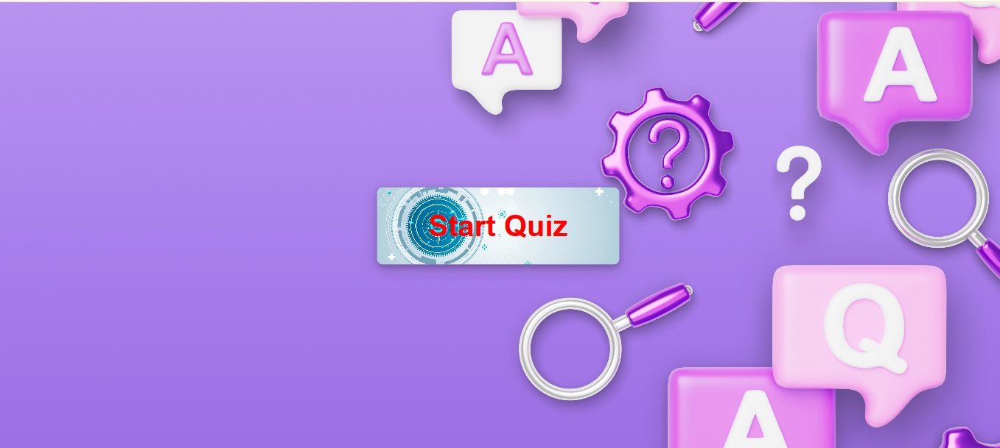
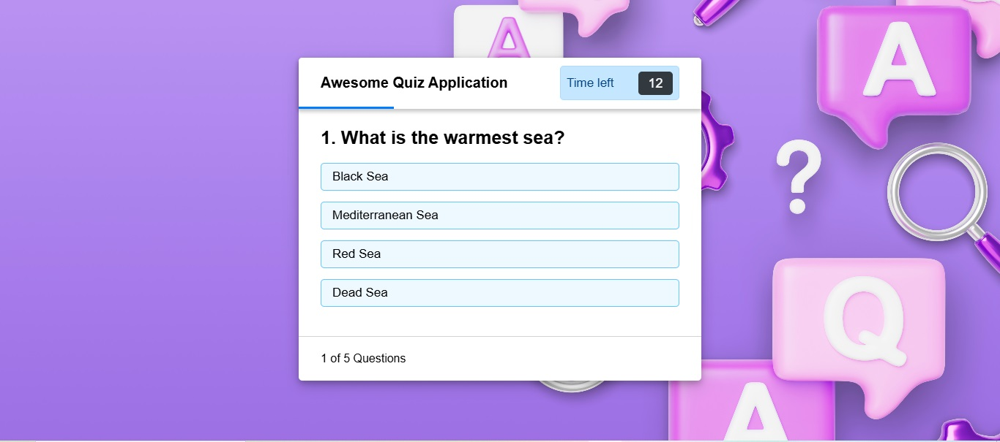
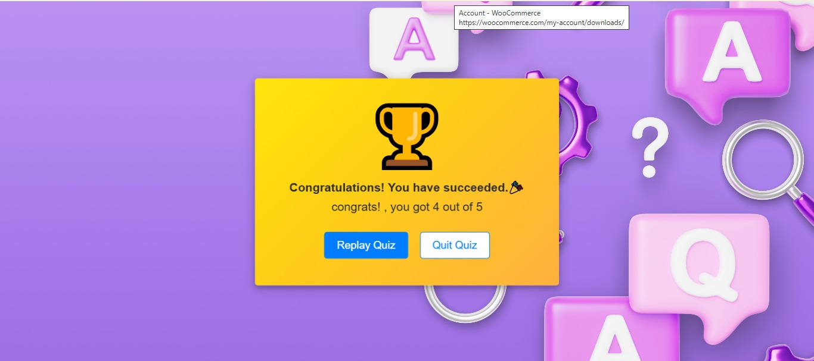

# 🎮 Quiz Game - First Project

An interactive **Quiz Game** built with HTML, CSS, and JavaScript. 
This project is designed to be beginner-friendly and demonstrates dynamic web UI behavior, user interaction, and responsive feedback through animations and timed challenges.

## 🧠 Features

- ✅ Start screen with a custom "Start Quiz" button
- 🕒 Countdown timer (15 seconds per question)
- ❌ Lock options after answering or timeout
- 🎯 Instant feedback on correct/wrong answers
- 🏁 Result screen with score and replay options
- 💡 Custom styles and responsive layout
- 🎨 Animations for winning and losing scenarios

## 🖥️ Demo Screens

| Start Screen | Quiz Interface | Result Box |
|--------------|----------------|-------------|
|  |  |  |

## 📁 Folder Structure

📁 quiz-game/
├── index.html
├── style.css
├── Questions.js
├── app.js
└── README.md

📌 No installation or build tools required! Just open in any modern browser.

🛠️ Built With
HTML5 – Structure

CSS3 – Layout & Styling

JavaScript – Game Logic & Timer

Font Awesome – Icons

Google Fonts – Typography

🔧 Possible Enhancements
 sound effects for answer feedback

▶️ How to Use

Click the "Start Quiz" button.

Read the rules and click "Continue".

Answer each question before the timer runs out.

View your score at the end.

Replay or quit as you like!

👨‍💻 Author
waleed39118 – (https://github.com/waleed39118/Quiz-Game)

🎉 Enjoy the game and feel free to contribute or suggest improvements!
